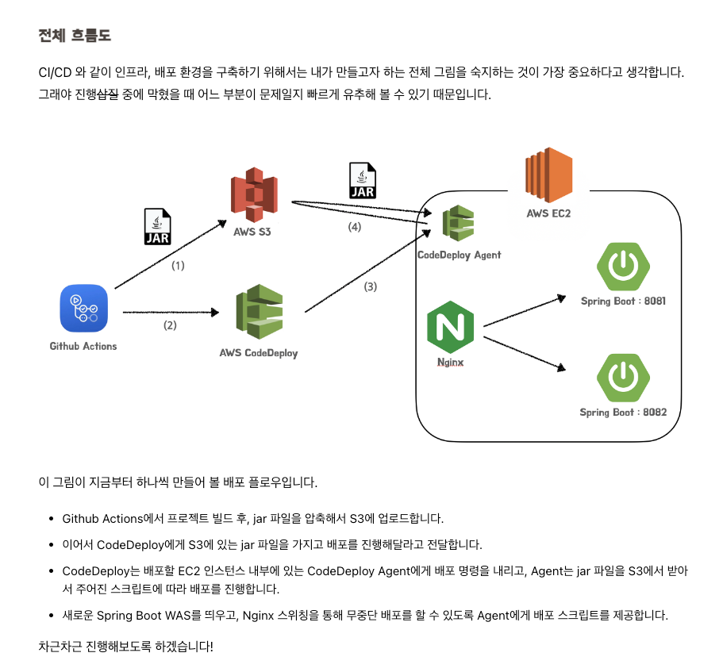
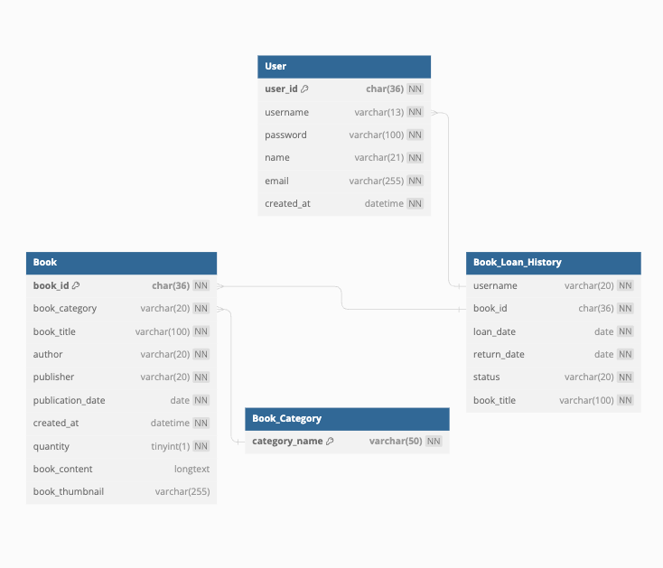

### 도서 대출 관리 시스템


### REST API
REST API를 처리하는 SpringBoot 프로젝트   


- 도메인 폴더 구조
> Controller - Service - Repository


## Structure
- **백엔드 기술**:
    - **Spring Boot**: 백엔드 서버를 구축하고 API를 개발하는 데 사용.
    - **Spring Security**: 패스워드 암호화 Bcrypt 사용
    - **MyBatis**: 
    - **Gradle**: 프로젝트 빌드 및 의존성 관리에 사용.
    - **MySQL**: 데이터 저장 및 관리를 위한 데이터베이스 시스템으로 사용.

```text
api-server-spring-boot
  > .github
    > workflows
      | deploy.yml //GitHub Actions에서 실행되는 CI/CD 워크플로의 설정 파일
  > build
    > libs
      | BookLoanSystem-0.0.1-SNAPSHOT.jar //빌드된 실행 가능한 JAR 파일
  > gradle
  > script
    | deploy.sh //배포 스크립트입니다. 이 스크립트는 프로세스를 중지하고, JAR 파일을 배포
  > src.main.java.com.bookloansystem.backend
    > common
        > config
          | SwaggerConfig.java //Swagger 설정을 정의
        > exceptions //사용자 정의 예외 클래스
          | BaseException.java
          | ExceptionAdvice.java
        > response //API 응답의 기본 구조를 정의
          | BaseResponse.java
          | BaseResponseStatus.java
        > util
          | UUIDGenerator.java //UUID를 생성하는 유틸리티 클래스
          | ValidationRegex.java //유효성 검증 정규 표현식 패턴을 정의한 클래스
        | Constant.java //상수 클래스
    > src
        > book //book 패키지
          > dto
            | PostBookLoanRes.java //도서 대출 이력 조회 응답 모델
            | PostBookReq.java //도서 등록, 도서 수정 모델
          > model
            | BookController.java
            | BookService.java
            | BookMapperRepository.java (interface)       
        > user //user 패키지
          > dto
            | PostLoginReq.java //로그인 요청 모델
            | PostUserReq.java //회원가입 요청 모델
          > model
            | UserController.java
            | UserService.java
            | UserMapperRepository.java (interface)  
        | BookLoanSystemApplication // SpringBootApplication 서버 시작 지점
    > resources
      > mybatis
        > mapper //SQL 쿼리를 정의
          | BookMapper.xml
          | UserMapper.xml
    | application.yml // Database 연동을 위한 설정 값 세팅 및 Port 정의 파일
  | gitignore
  | appspec.yml //AWS CodeDeploy의 애플리케이션 스펙 파일
  | build.gradle
```
## ERD



